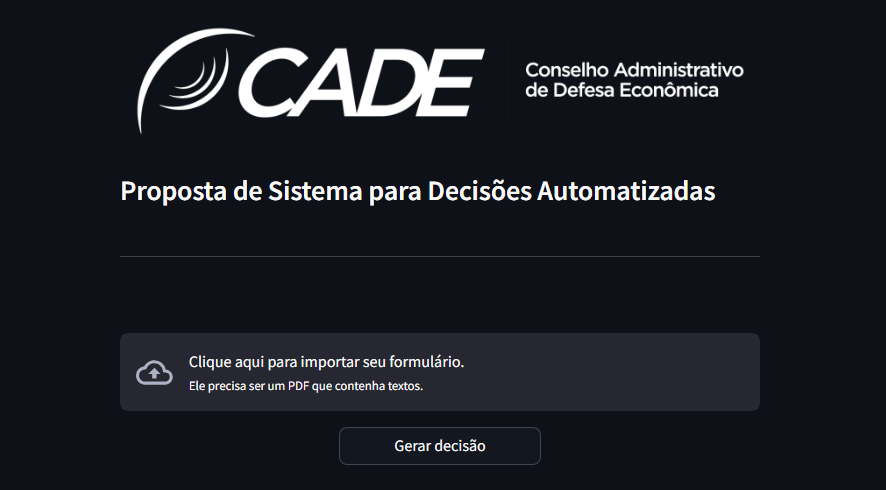
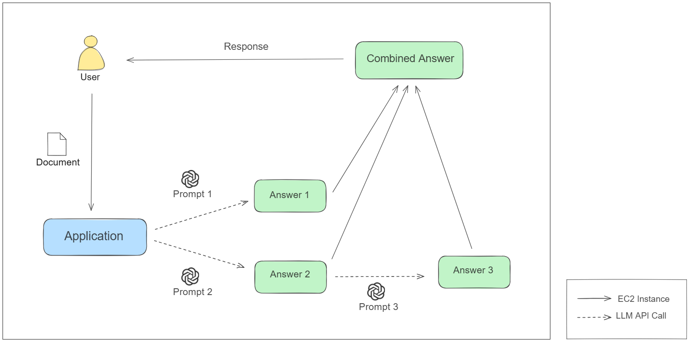

# Sistema para Decisões Automatizadas

<p align="center">
  
  
  
  
</p>

Este projeto utiliza **Python**, **Streamlit**, **OpenAI** e **LangChain** para processar documentos PDF e gerar respostas automáticas com base em um modelo de tomada de decisões. 

## Funcionalidades

- **Importação de PDF**: O usuário pode subir um PDF contendo textos para o sistema.
- **Extração de Texto**: O conteúdo do PDF é extraído e processado.
- **Geração de Respostas**: Com base nas informações fornecidas, o sistema gera:
  - Uma **descrição da operação**.
  - **Considerações detalhadas** sobre os aspectos da operação.
  - Uma **conclusão** se a operação pode ser aprovada ou se precisa de mais análise.
- **Feedback**: O usuário pode avaliar a decisão gerada e fornecer feedback textual sobre a resposta automatizada.

## Preview

<p align="center">
  
</p>

## Esquema do Funcionamento

<p align="center">
  
</p>


## Estrutura do Projeto

```
│   .gitignore
│   config.py
│   config.toml
│   main.py
│   README.md
│   requirements.txt
│   
├───images
│       image-1.png
│       image-2.png    
└───venv
```

- **main.py**: Arquivo principal que executa a aplicação Streamlit.
- **config.py** e **config.toml**: Arquivos de configuração do sistema.
- **images/**: Diretório contendo as imagens usadas no projeto.
- **venv/**: Ambiente virtual para isolamento das dependências do projeto.

## Instalação e Execução

### Pré-requisitos

- **Python 3.8+**
- **pip** (gerenciador de pacotes do Python)
- **Docker** (opcional, para executar o projeto em um contêiner)

### Passos para rodar o projeto

#### Opção 1: Executar Localmente

1. Clone o repositório para sua máquina local:

    ```bash
    git clone https://github.com/seu-usuario/seu-projeto.git
    cd seu-projeto
    ```

2. Instale as dependências:

    ```bash
    pip install -r requirements.txt
    ```

3. Execute a aplicação:

    ```bash
    streamlit run main.py
    ```

4. Acesse o sistema em: `http://localhost:8501` e comece a interagir com a interface.

#### Opção 2: Executar com Docker

Se preferir executar o projeto em um contêiner Docker, você pode criar um `Dockerfile` e construir a imagem. Um exemplo básico de `Dockerfile` pode ser assim:

```Dockerfile
# Use a imagem base do Python
FROM python:3.8-slim

# Defina o diretório de trabalho
WORKDIR /app

# Copie o arquivo de requisitos e instale as dependências
COPY requirements.txt .
RUN pip install -r requirements.txt

# Copie o código fonte para o contêiner
COPY . .

# Comando para rodar a aplicação
CMD ["streamlit", "run", "main.py"]
```

1. Construa a imagem Docker:

    ```bash
    docker build -t esse-projeto .
    ```

2. Execute o contêiner:

    ```bash
    docker run -p 8501:8501 esse-projeto
    ```

3. Acesse o sistema em: `http://localhost:8501` e comece a interagir com a interface.

---

**Autor**: [João Pedro Campos Faria](https://github.com/ocamposfaria)
