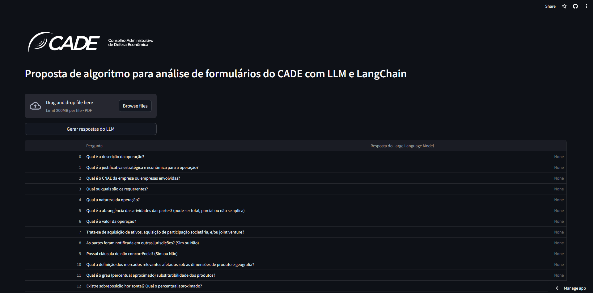

## Aplicativo para análise de formulários de decisões 
### Proposta de algoritmo para implementação em sistema do CADE **[NÃO OFICIAL]**

Hospedado em:
https://mestrado-luisa.streamlit.app/

### Resumo
Esse repositório contém um aplicativo em Streamlit que analisa formulários de decisões do Conselho Administrativo de Defesa Econômica (CADE) para extrair informações neles contidas. Trata-se de 17 perguntas levantadas, a serem respondidas por um Large Language Model (provisoriamente, Chat GPT 3.5), e assim tornar mais rápida a classificação desses formulários de decisões, para fins de agilizar processos do órgão.

O algoritmo, no momento, encontra-se na forma de uma aplicação web desenvolvida em Python, utilizando principalmente as bibliotecas Streamlit e LangChain.  A escolha pela utilização do modelo da Open AI, bem como Streamlit, são para fins de testes e prototipagem, e não reflete a solução final a ser (ou não) implementada pelo órgão.

### Preview

Visualize um preview da página, abaixo.

### Instruções de utilização do protótipo

1. Ao abrir a página, é possível visualizar uma tabela com uma série de perguntas que serão feitas a um formulário desejado. Para isso, é necessário clicar no botão "Browse files" e escolher um formulário de sua escolha do diretório do seu computador.
2. Em seguida, clique no botão "Gerar respostas do LLM". Isso irá inicializar a extração das informações do PDF. Quando a extração finalizar, será possível visualizar as respostas do LLM na tabela, no campo "Respostas do Large Language Model", que antes encontrava-se vazio.